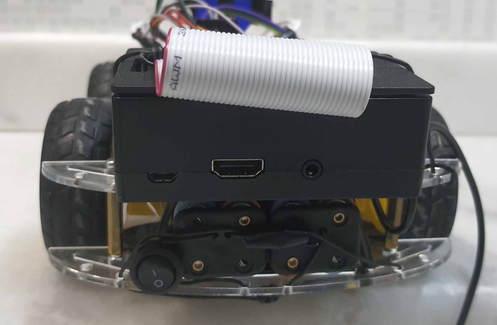

# Eye Tracking Robot

This robot is a small scale prototype of a device which gives people with spinal cord paralysis the ability to travel by
themselves.

* PyQt5 GUI which has controls for MQTT communication and eye tracking.

    

* The robot.


    <table>
      <tr>
        <td colspan="2"></td>
      </tr>
      <tr>
        <td></td> 
        <td></td>
      </tr>
      <tr>
        <td colspan="2"></td>
      </tr>
    </table>
    <table>
    


<!-- START doctoc generated TOC please keep comment here to allow auto update -->
<!-- DON'T EDIT THIS SECTION, INSTEAD RE-RUN doctoc TO UPDATE -->
## Contents

- [About](#about)
- [Requirements](#requirements)
- [Running Application Locally](#running-application-locally)
  - [Raspberry Pi](#raspberry-pi)
  - [PC](#pc)
- [License](#license)
- [Contributors](#contributors)

<!-- END doctoc generated TOC please keep comment here to allow auto update -->

## About

`eye_tracking/interface.py` script starts a GUI written in PyQt5. GUI runs in a PC which has a camera
connected to it. From this camera user's eye movements are tracked. Eye tracking algorithm is located at the 
`eye_tracking/app/eye_tracking.py` file. Left, right, up, down and center are the valid iris locations. These location
information are sent to the robot every 1.5 seconds. GUI and robot communicates with the MQTT protocol using Wi-Fi.

The robot has 4 wheels each connected with a 6V DC motor. Left side and right side of the robot can be controlled
independent of each other with the L298N motor driver board. 

The robot also has HC-SR04 ultrasonic sensor mounted at its
front. Using this sensor, distance to the obstacles can be calculated. An RGB LED lights up with the colors red, yellow and
blue each corresponding to the distances less than 60 centimeters, between 60 and 130 centimeters and more than 130
centimeters. Also forward movement of the robot is blocked when distance to the obstacle becomes less than 60
centimeters. 

Two series-connected quadruple AA battery beds are used to power the motor driver. The output of this
battery, which provides 12 V, is connected to the voltage regulator and reduced to 8 V. In this way, the motors can be
driven with constant voltage without being affected by the charge rate of the batteries. Since the transistors in the
motor driver have a voltage drop of 2 V, a constant 6 V voltage can be supplied to the motors.

## Requirements

* Python 3.10
* Raspberry Pi with Wi-Fi connection
* 4 x 6V DC gear motors
* 1 x L298N motor driver board
* 2 x Quadruple AA battery holder
* 8 x AA batteries
* 1 x 12V to 8V DC-DC buck converter 
* 1 x HC-SR04 ultrasonic sensor and mounting platform
* 1 x RGB LED
* 1 x on-off switch

## Running Application Locally

### Raspberry Pi

1. Install Python dependencies.
    ```sh
    cd controlling_robot
    pip3 install -r requirements.txt
    ```

1. Change MQTT broker address line in the `robot.py`.
1. Launch the robot driving script.
    ```sh
    python3 eye_controlled_robot.py
    ```

### PC

1. Install Python dependencies.
    ```sh
    cd eye_tracking
    pip3 install -r requirements.txt
    ```
1. Launch the GUI.
    ```sh
    python3 interface.py
    ```

## License

Eye Tracking Robot is free software published under the MIT license. See [LICENSE](LICENSE) for details.

## Contributors

* [Erkan Vatan](https://github.com/arensonzz): Assembly of the robot, robot controlling scripts, MQTT connections, documentation
